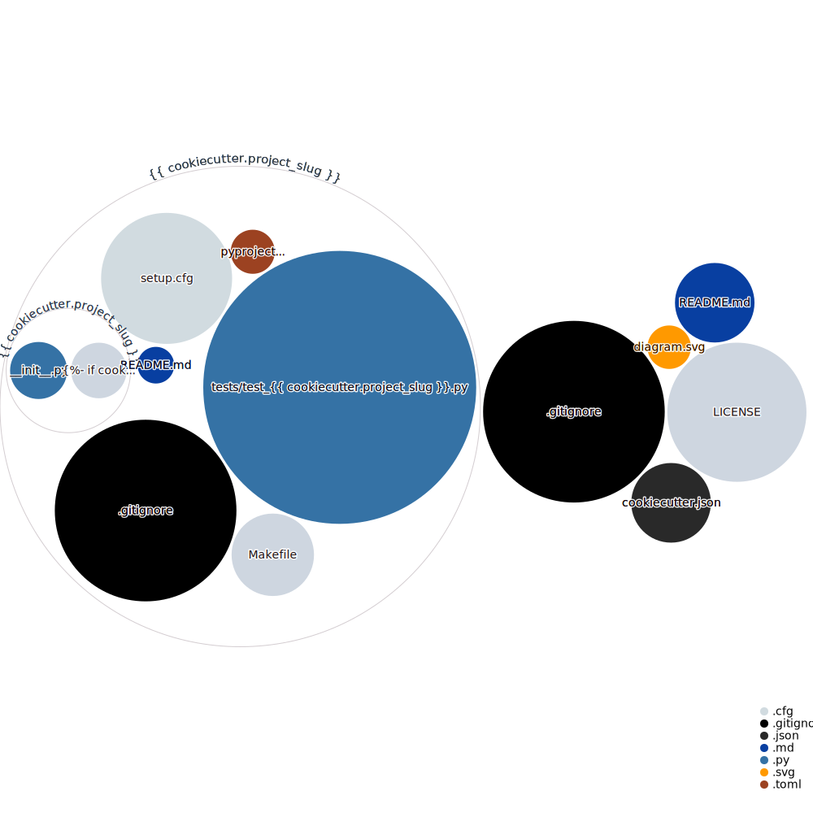

# Cookiecutter PyPackage

To use:

```bash
pip install cookiecutter
cookiecutter https://github.com/BlockOG/cookiecutter-pypackage
```

To run tests, build and upload the project:

```bash
make build
```

To easily update your local installation with the uploaded version:

```bash
make install
```

Repo diagram:


